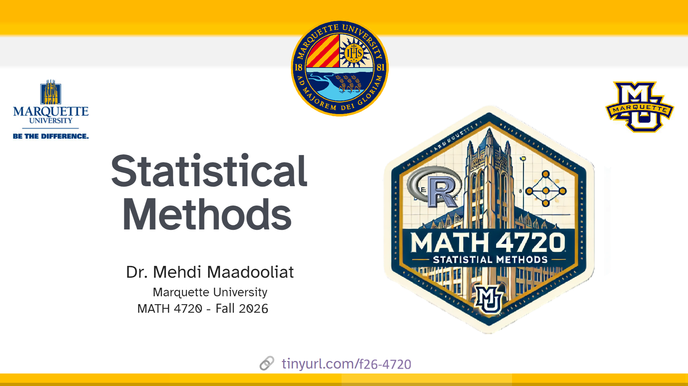

This is the homepage for MATH 4720 (MSSC 5720) - Statistical Methods by [Dr. Mehdi Maadooliat](www.mssc.mu.edu/~mehdi) in Fall 2026 at Marquette University. All course materials will be posted on this site.

You can find the course syllabus [here](/course-syllabus.html) and the course schedule [here](/).

## Class meetings

| Meeting      | Location | Time                                      |
|--------------|----------|-------------------------------------------|
| Lecture      | CU 145   | Tue & Thur 9:30 am - 10:45 am             |
| Office Hours | CU 351   | Tu 1:45pm - 3:15pm & Th 10:45am - 12:15pm |

